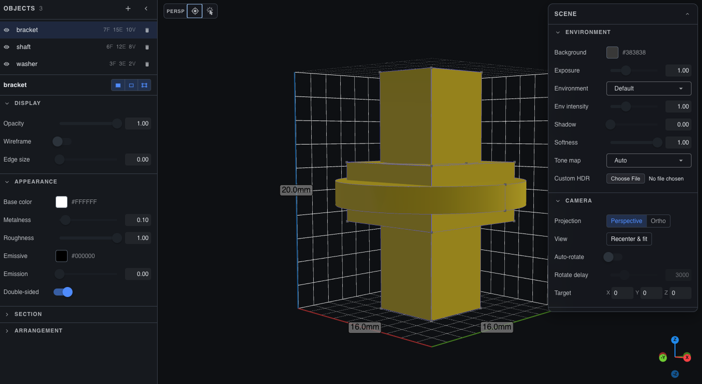

# CadQuery Web Viewer

[](https://pypi.org/project/cadquery-web-viewer/)
[](https://pypi.org/project/cadquery-web-viewer/)
[](LICENSE)
[](https://github.com/jimcortez/cadquery-web-viewer/actions/workflows/ci.yml)
[](https://pypi.org/project/cadquery-web-viewer/)

**Preview CadQuery or build123d models in your browser** and refresh the view while you edit Python — without manually exporting meshes each time.

[**Try it live →**](https://jimcortez.github.io/cadquery-web-viewer/)



> Place a screenshot or short GIF of the running viewer at `assets/screenshot.png`. The image is referenced here so the README renders the hero once committed; until then GitHub will show a broken image. Open an issue if you'd like a starting screenshot grabbed from the live demo.

## What you get

- **Browser viewer** for 3D models: orbit, zoom, measurements, clipping, transparency, and related viewing tools.
- **glTF 2.0 / GLB** — a standard mesh format many 3D tools understand. The UI is built around the web [model-viewer](https://modelviewer.dev/) component, so you get common material and lighting behavior in the browser.
- **Live updates** while you change geometry in Python (the app keeps a channel open so the page can refresh when you publish again).
- **Optional disk cache** for uploaded GLBs when you run the long-lived server — see [Usage](docs/usage.md).

The API and packaging are meant to be a **mostly drop-in replacement** for [Yet Another CAD Viewer (YACV)](https://github.com/yeicor-3d/yet-another-cad-viewer). Package renames and choosing how Python talks to the viewer — embedded server, separate server process, or buffer-only (`server_type`) — are covered in [Migrating from `yacv-server` / `yacv-viewer`](docs/yacv_migration.md); project history and upstream links are in **Special thanks** at the end of this file.

## Table of contents

- [Quick start](#quick-start)
- [What you get](#what-you-get)
- [Documentation](#documentation)
- [Examples in this repo](#examples-in-this-repo)
- [Trust model](#trust-model)
- [Contributing](#contributing)
- [Special thanks](#special-thanks)

## Quick start

Requires **Python 3.10 through 3.13** (see `requires-python` in `pyproject.toml`).

### Install with pip

The viewer package depends on **build123d**. The example below uses **CadQuery**, which is a separate install:

```bash
python -m venv .venv
source .venv/bin/activate  # Windows: .venv\Scripts\activate
pip install cadquery-web-viewer cadquery
```

While the venv is active, run `cadquery-web-viewer` or `python -m cadquery_web_viewer`.

Other install methods (pipx, uv tool, Docker): [docs/install.md](docs/install.md).

### Preview a CadQuery box locally

The library starts a small local server and a browser tab. By default the process **waits until you close the viewer tab**, so short scripts do not exit before you inspect the model.

```python
import cadquery as cq

from cadquery_web_viewer import show

box = cq.Workplane().box(10, 10, 10)
show(box)
```

More options (host, port, timeouts, multiple `show()` calls): [docs/usage.md](docs/usage.md).

### Same box with a remote server

In **one terminal**, keep the viewer running:

```bash
cadquery-web-viewer --host localhost --port 32323
```

In **another terminal**, with the same Python environment:

```python
import cadquery as cq

from cadquery_web_viewer import show

box = cq.Workplane().box(10, 10, 10)
show(
    box,
    server_type="remote",
    remote_options={"host": "localhost", "port": 32323},
)
```

## Documentation

- [Installation](docs/install.md) — pipx, uv tool, Docker, and other install paths
- [Usage](docs/usage.md) — long-lived server, cache, `show()` options
- [HTTP API](docs/api.md) — Flask `/api` endpoints (SSE, GLB upload, static UI), trust model
- [Migrating from YACV](docs/yacv_migration.md)
- [Development](docs/development.md)
- [Changelog](CHANGELOG.md)

## Examples in this repo

| Folder | Purpose |
|--------|---------|
| [`examples/in-process/`](examples/in-process/) | Full build123d sample, `show()` with optional textures; with `CI` set, runs `export_all("export")` after the viewer closes (not run in GitHub Actions). |
| [`examples/remote/`](examples/remote/) | Same style of model sent with `server_type="remote"`. |

## Trust model

`cadquery-web-viewer` is intended for **localhost or trusted networks only**:

- The HTTP API serves CORS `Access-Control-Allow-Origin: *`, so any origin may call it from a browser.
- `PUT /api/object/<name>` accepts a JSON body with a `url` field and the server fetches that URL (up to 50 MB) over `http`/`https`.
- The Python runtime is plain `flask.Flask.run` — there is no auth, rate limiting, or TLS.

For details and operational guidance, see [SECURITY.md](SECURITY.md) and the *Trust model* section of [docs/api.md](docs/api.md).

## Contributing

See [CONTRIBUTING.md](CONTRIBUTING.md) for the dev loop, test/lint/typecheck commands, and PR conventions. Bug reports and feature requests are welcome on the [issue tracker](https://github.com/jimcortez/cadquery-web-viewer/issues).

## Special thanks

[Yet Another CAD Viewer (YACV)](https://github.com/yeicor-3d/yet-another-cad-viewer) by Yeicor and contributors is the original project: a web-based CAD and GLB viewer with a Python backend for live tessellation, hot reload, and static export. This repository is a hard fork, with credit to the original authors.

[MIT License](LICENSE). Third-party notices: [assets/licenses.txt](assets/licenses.txt).
